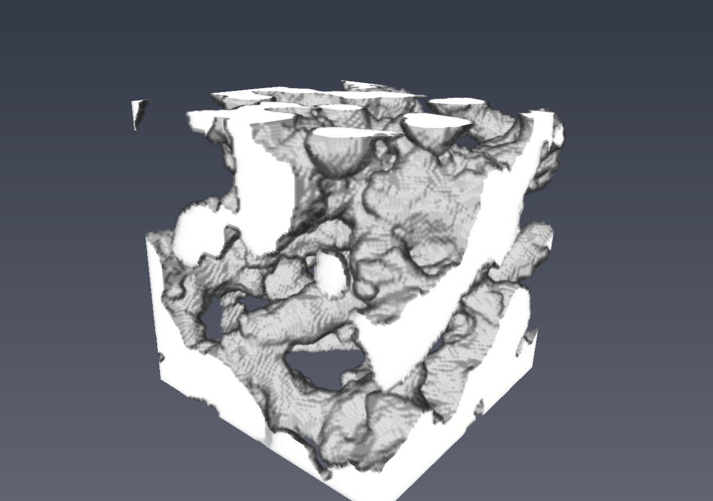
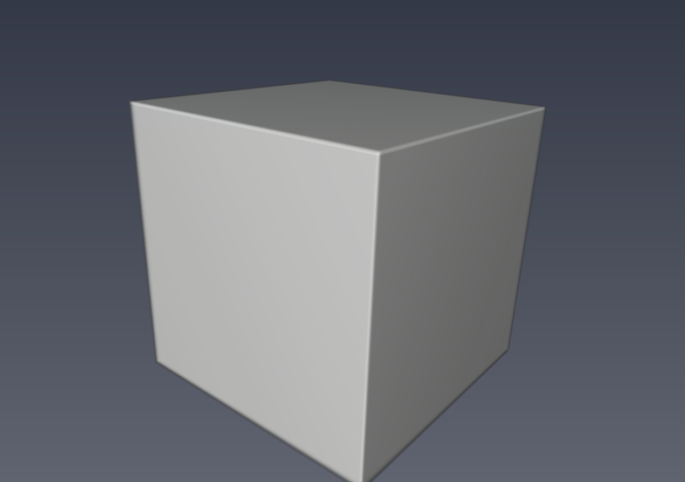

Accessible Volume
******************

The algorithm takes in a binary 3D image (Usually a scaffold images) and calculates the accessible volume for a range of sphere sizes. The algorithm also takes in input mask which defines the boundary of the volume from where the accessibility is measured. The algorithm is described in Sheng Yue PhD thesis. (http://dx.doi.org/10.1016/j.jmatprotec.2014.05.006)

API
----
.. code-block:: python
   
   AccessibleVolume(input_data, mask_data, origin, voxel_size, sphere_diameter_range_min_in_log, sphere_diameter_range_max_in_log, number_of_spheres_in_range, input_image_resolution)
   
   input_data: numpy array 3d volume and has to be an 8bit data.
   mask_data: numpy array 3d mask volume and it has to be an 8bit data.
   voxel_size: numpy array with sizes along 3 dimensions (x_size,y_size,z_size)
   origin: numpy array with origin of the volume (x_center, y_center, z_center)
   sphere_diameter_range_min_in_log: logarithmic value of minimum sphere diameter range that need to be used in calculating accessible volume.
   sphere_diameter_range_max_in_log: logarithmic value of maximum sphere diameter range that need to be used in calculating accessible volume.
   number_of_spheres_in_range: the number of spheres diameters that are used in the input sphere diameter range for which accessible volume is calculated.
   input_image_resolution: image resolution usually (1.0).

   returns: AccessibleVolume numpy array with sphere diameter and corresponding Accessible Volume

   
Example
--------

To run the example code you need to download the following files :download:`Input Data <../../test/Data128.tif>` and :download:`Mask Data <../../test/DataMask128.tif>`

To run the below code you need to install the following packages:

   * tifffile ( conda install -c conda-forge tifffile )
   
   
.. code-block:: python

   from ccpi.quantification.AccessibleVolume import AccessibleVolume
   import numpy as np
   import math
   from tifffile import TiffFile    
   #input 3d data volume, has to be binary volume.
   data = TiffFile('Data128.tif')
   #input 3d mask
   mask = TiffFile('DataMask128.tif')
   #voxel size
   voxel_size = np.ones(3,dtype=np.float32)
   #voxel origin
   origin = np.zeros(3,dtype=np.float32)
   #Invoke the Accessible volume algorithm
   av = AccessibleVolumeInput(data.asarray(), mask.asarray(), origin, voxel_size,math.log(80.0), math.log(600.0), 11, 9.0 )
   
   print(av)
   
   data.close()
   mask.close() 

Input Volume

Mask Volume

.. image:: ../../pics/AccessibleVolume.jpg   
