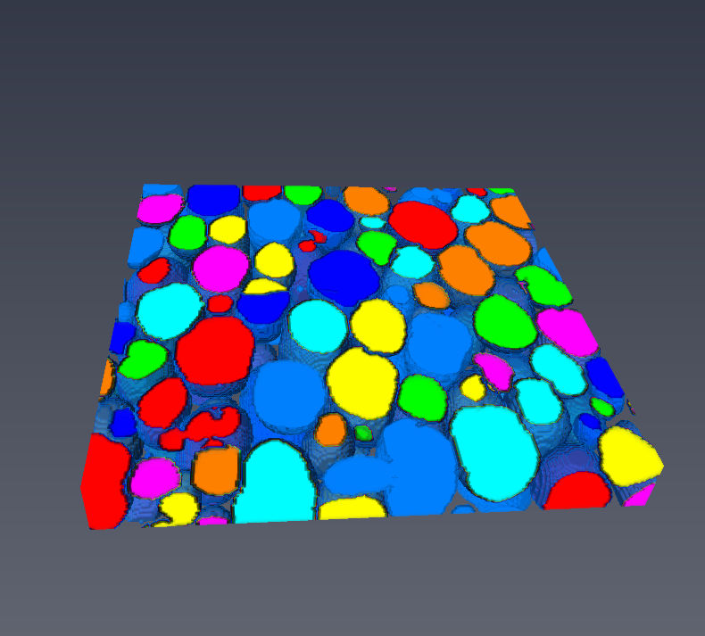
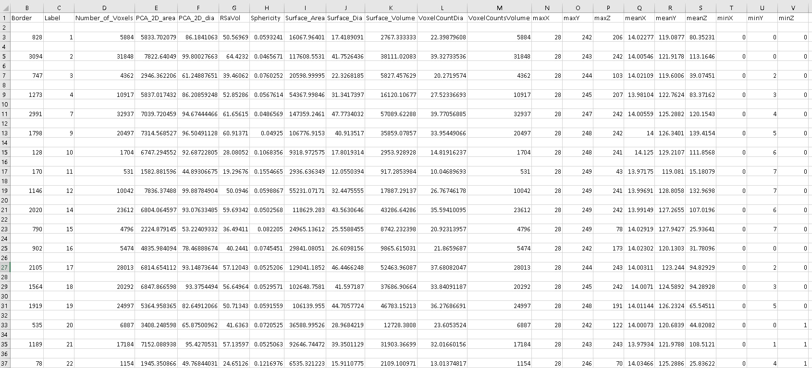

Label Quantification
*********************

This algorithm takes in a labelled image and calculates several characteristics for each label. Below are some of the characteristics 

* Volume by voxel counts
* Equivalent sphere diameter by voxel counts
* Bounding box diagonal
* Principal Component Analysis (PCA)
* Ellipsoid fitting by PCA
* Equivalent circle diameter by PCA
* Isosurface by marching cude.
* Surface area
* Surface Volume
* Equivalent sphere diameter from surface volume
* Sphercity
* Normalised surface area to volume ratio (Radius*Sa/Vol)

The details of this algorithm are given in Evaluation of 3D bioactive glass scaffolds dissolution in a perfusion flow system with X-ray microtomography. Yue S, Lee PD, Poologasundarampillai G, Jones JR. DOI: 10.1016/j.actbio.2011.02.009

API
----

.. code-block:: python

	LabelQuantification(input_3d_volume, origin, voxel_size, min_data_value, max_data_value, minimum_feature_size)

	input_3d_volume: numpy array of 3d volume. data type reflects the function suffix.
	origin: numpy array with 3 values. 
	voxel_size: numpy array representing a voxel size in three dimensions (x,y,z)
	min_data_value: minimum value of the input volume
	max_data_value: maximum value of the input volume
	minimum_feature_size: minimum size of the feature
	
	returns: an list with feature names and another numpy array with each row representing a label and it corresponding values.
	
Example
--------

To run the example code you need to download the following data file: :download:`Foam Data <../../test/FoamData.tif>`

To run the below code you need to install the following packages:

   * tifffile ( conda install -c conda-forge tifffile )
   
.. code-block:: python
  
    # Imports
    from ccpi.quantification.LabelQuantification import LabelQuantification
    import numpy as np
    import math
    from tifffile import TiffFile        
	
	#Read the input volume which is labelled during segmentation
    img = TiffFile('FoamData.tif')        
    data = img.asarray()
	
	#voxel size
    voxel_size = np.ones(3,dtype=np.float32)
	#origin
    origin = np.zeros(3,dtype=np.float32)
	
	#computes the 3d quantification
    lqsNames, lqsValues = LabelQuantification(data, origin, voxel_size, float(np.amin(data)), float(np.amax(data)), 100.0)
    lqs.compute()
	
    print(lqsNames)
    img.close()

