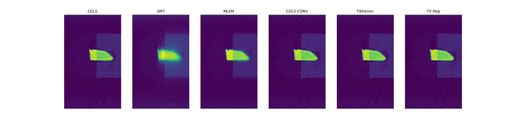

Reconstruction Module
######################

Installation
**************

CCPi Reconstruction codes are only available as binary distribution. Anaconda distribution of python is required, Download and installation instructions are available at https://www.continuum.io/downloads. Please follow the instructions below for installing CCPi Reconstruction codes from anaconda channel.

::

 conda install -c ccpi ccpi-reconstruction -c conda-forge

CCPi Iterative Reconstruction Algorithms
*****************************************
 
There are three main iterative reconstructions available in this package. they are 

* Conjugate Gradient Least Squares (CGLS)
* Maximum Likelihood Estimation Method (MLEM)
* Simultaneous Iterative Reconstructive Technique (SIRT)

In addition to the above methods there are three more varients of CGLS available in this package. they are 

* CGLS with Convolution
* CGLS with Tikhonov regularization
* CGLS with Total Variation Regularisation (TV)

These reconstruction algorithms currently only work on the parallel beam datasets. The next version will have a support for iterative reconstruction algorithms for cone beam datasets.

API
====

The Python wrapper for the CIL uses numpy arrays as medium to pass data to and from each algorithm. 

.. code-block:: python
    
	ccpi.reconstruction.parallelbeam.alg.cgls(normalized_sinogram, projection_angles, center_of_rotation , resolution, number_iterations, threads, isPixelDataInLogScale)
	ccpi.reconstruction.parallelbeam.alg.mlem(normalized_sinogram, projection_angles, center_of_rotation , resolution, number_iterations, threads, isPixelDataInLogScale)
	ccpi.reconstruction.parallelbeam.alg.sirt(normalized_sinogram, projection_angles, center_of_rotation , resolution, number_iterations, threads, isPixelDataInLogScale)
	
	ccpi.reconstruction.parallelbeam.alg.cgls_conv(normalized_sinogram, projection_angles, center_of_rotation , resolution, number_iterations, threads, regularize, isPixelDataInLogScale)
	ccpi.reconstruction.parallelbeam.alg.cgls_tikhonov(normalized_sinogram, projection_angles, center_of_rotation , resolution, number_iterations, threads, regularize, isPixelDataInLogScale)
	ccpi.reconstruction.parallelbeam.alg.cgls_TVreg(normalized_sinogram, projection_angles, center_of_rotation , resolution, number_iterations, threads, regularize, isPixelDataInLogScale)
	
	:parameters:
	normalized_sinogram: a numpy array with float32 values representing a sinogram. This can be in -log() values, if so then set the isPixelDataInLogScale to True.
	projection_angles: a numpy array with float32 values representing angles in degress.
	center_of_rotation: a double value specifying the center of rotation
	resolution: an integer values representing the resolution of number of pixels per voxel.
	number_iteration: an integer value representing the number of iteration the algorithm need to run.
	threads: an integer value representing the number of CPU cores to use for computation
	isPixelDataInLogScale: an boolean value representing whether the sinogram values are in -log() or not.
	regularize: an double value representing the regularization factor.
	
	returns: an numpy array with float32 representing an reconstructed volume.
	
	
Example
========

Let us go through an example that will reconstruct the `dataset <https://github.com/DiamondLightSource/Savu/blob/master/test_data/data/24737_fd.nxs>`_
that is available at the savu GitHub repository.

In the following we go through an example. First we must run the imports:

::

 from ccpi.reconstruction.parallelbeam import alg
 import numpy
 import h5py

After imports one should load the dataset. The pre-processing, i.e. load the nexus (hdf5) file, extracting the angles and image data, 
scaling to 0-1 scalar range are done within the load_data function. 

::

	## 1) load a dataset:

	# This dataset is freely available at
	# https://github.com/DiamondLightSource/Savu/blob/master/test_data/data/24737_fd.nxs 
		
	filename = "24737_fd.nxs"
	norm, angle_proj = load_data(filename)

	
Now one can pass the data to the 6 different reconstruction algorithm that are available within the CCPi reconstruction package.
One should set 

1. the center of rotation, 
2. the number of iterations,
3. the number of CPU threads that one wants to use, 
4. regolarisation parameters (only for CGLS_CONV, CGLS_TIKHONOV, CGLS_TVregularization)

::
	
	## 2) 
	## 
	## Data can now be passed to the reconstruction algorithms:
	## CGLS, MLEM, SIRT, CGLS_CONV, CGLS_TIKHONOV, CGLS_TVregularization
	# center of rotation
	center_of_rotation = numpy.double(86.2)
	# resolution
	resolution = 1
	# number of iterations
	niterations = 15
	# number of threads
	threads = 3

	# CGLS
	img_cgls = alg.cgls(norm, angle_proj, center_of_rotation , resolution , 
			    niterations, threads, isPixelDataInLogScale)
	# MLEM
	img_mlem = alg.mlem(norm, angle_proj,  center_of_rotation , resolution , 
			    niterations, threads, isPixelDataInLogScale)
	# SIRT
	img_sirt = alg.sirt(norm, angle_proj, center_of_rotation , resolution ,  
			    niterations, threads, isPixelDataInLogScale)

	# CGLS CONV
	iteration_values1 = numpy.zeros((niterations,))
	img_cgls_conv = alg.cgls_conv(norm, angle_proj, center_of_rotation , 
				      resolution , 
				      niterations , threads,
				      iteration_values1 , isPixelDataInLogScale)

	#Regularization parameter
	regularization = numpy.double(1e-3)

	# CGLS TIKHONOV
	iteration_values2 = numpy.zeros((niterations,))
	img_cgls_tikhonov = alg.cgls_tikhonov(norm, angle_proj, center_of_rotation , 
					      resolution , niterations, threads,
					      regularization, iteration_values2 , 
					      isPixelDataInLogScale)

	# CGLS Total Variation Regularization 
	iteration_values3 = numpy.zeros((niterations,))
	img_cgls_TVreg = alg.cgls_TVreg(norm, angle_proj, center_of_rotation , 
					resolution ,  niterations, threads,
					      regularization, iteration_values3,
					      isPixelDataInLogScale)

One may want to compare the results of the reconstruction algorithms:

::

	## 3) Visualize a slice of the reconstructed images 

	import matplotlib.pyplot as plt
	fs = 10
	fig, ax = plt.subplots(1,6,sharey=True)
	ax[0].imshow(img_cgls[80])
	ax[0].axis('off')  # clear x- and y-axes
	ax[0].set_title("CGLS" , fontsize = fs)

	ax[1].imshow(img_sirt[80])
	ax[1].axis('off')  # clear x- and y-axes
	ax[1].set_title("SIRT" , fontsize = fs)

	ax[2].imshow(img_mlem[80])
	ax[2].axis('off')  # clear x- and y-axesplt.show()
	ax[2].set_title("MLEM" , fontsize = fs)

	ax[3].imshow(img_cgls_conv[80])
	ax[3].axis('off')  # clear x- and y-axesplt.show()
	ax[3].set_title("CGLS CONV" , fontsize = fs)

	ax[4].imshow(img_cgls_tikhonov[80])
	ax[4].axis('off')  # clear x- and y-axesplt.show()
	ax[4].set_title("Tikhonov" , fontsize = fs)

	ax[5].imshow(img_cgls_TVreg[80])
	ax[5].axis('off')  # clear x- and y-axesplt.show()
	ax[5].set_title("TV Reg" , fontsize = fs)
	plt.show()

The whole demo code
=====================

The complete demo can be downloaded at :download:`Reconstruction CGLS Demo <../test/reconstruction_cgls.py>`. To run the demo you need to download the sample `dataset <https://github.com/DiamondLightSource/Savu/blob/master/test_data/data/24737_fd.nxs>`_  and install the following packages

* matplotlib
* h5py

