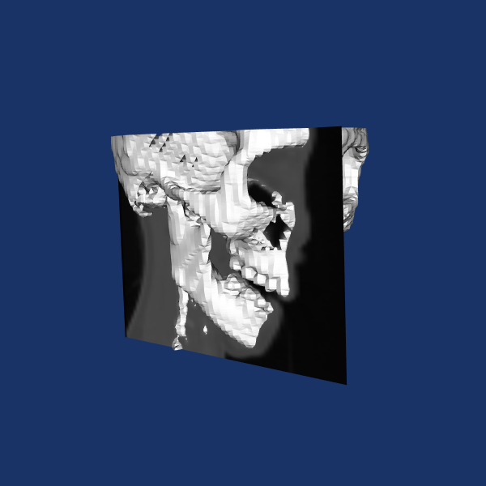

Segmentation Module
===================

Segmentation is the process from which, given a 3 dimensional dataset (volume), surfaces in the volume are found at a 
specific value. Such surfaces are also called isosurfaces.

=================================
Simpleflex Segmentation Algorithm
=================================

The CIL provides the Segmentation Algorithm described by Carr et al. [Carr2003]_ based on the calculation of the contour tree. 
The algorithm is developed in C++ and it is fully wrapped in Python. 

The algorithm expects to receive a 3D numpy array as input, and outputs a numpy array with the location of 
the points of the isosurfaces in image coordinates. 
It must be pointed out that there are at least 2 reference system of the points
of an image: 

- Image Coordinate: the actual pixel number in each dimension
- World Coordinate: the location in the *real world*
  
World coordinates are linear transformation of the image coordinate. For example, the size of the pixel (voxel) may not be uniform in the 3 dimensions resulting in a stretched image in some direction. 

The algorithm itself has no clue about the world-coordinates and its output is in image-coordinates. The user is required to apply the appropriate transformations to translate image coordinates to world coordinates. In the example that follows we will make a 
image-to-world transformation. 

------------
Installation
------------

A binary installation is available from the ccpi conda channel:

::

    conda install -c ccpi -c conda-forge ccpi-segmentation numpy=1.12

-----
Usage
-----
The Python wrapper for the CIL uses numpy arrays as medium to pass data to and from each algorithm. 
3D image data should be passed to the simpleflex algorithm in form of 3D numpy arrays. 

The algorithm outputs numpy arrays.

To explain how to use it let us go through an example. In the example we will use the viewer that can be downloaded `here <https://github.com/vais-ral/CILViewer>`_. The data we will be using is from `VTKData <https://github.com/naucoin/VTKData/tree/master/Data/headsq>`_. 

First of all, we start with the proper imports:
:: 
    
    from ccpi.segmentation.SimpleflexSegmentor import SimpleflexSegmentor
    import numpy
    import vtk
    from vtk.util import numpy_support
    from CILViewer import CILViewer
    

The Create a Segmentor and pass data
....................................

The algorithm accepts input as 3D numpy arrays. It will detect the dimensions and it will scale the image to an appropriate size (unsigned short or unsigned char). The only thing to pay attention to is the axis order: normally images are stored in contiguous arrays and the index is calculated as :
::

    index = x + y * DimX + z * DimX * DimY
    
For historical reasons, the simpleflex algorithm indexes the axis swapping the Z and the X axis and its index is:
:: 

    index = z + y * DimZ + x * DimZ * DimZ

The algorithm is wrapped in a Object oriented fashion, and therefore it needs to be instatiated and passed the data. 
::
    
    # 1. create a segmentor object
    segmentor = SimpleflexSegmentor()

    # 2. Load some data and pass data into the algorithm
    # load data with vtk
    filename = "C:\\Path\\to\\VTKData\\Data\\headsq\\quarter"

    # read the data as 3D numpy array
    data3d , reader = readAs3DNumpyArray(filename)

    # VTK images have swapped Z/X axis with respect to the Simpleflex algorithm
    segmentor.setAxisOrder([2,1,0])

    # accepts input as 3D numpy array
    segmentor.setInputData(data3d)

Running the segmentation
........................

The only thing to specify to the algorithm is the target isovalue:
::
    
    # 3. Calculate the Contour Tree
    segmentor.calculateContourTree()

    # 4. Set the iso-value in percent of the image dynamic range
    # one can also pass the actual value 
    #segmentor.setIsoValue(some_value)
    segmentor.setIsoValuePercent(35)

    # 5. Construct the iso-surfaces
    segmentor.constructIsoSurfaces()

Retrieve the data
.................

To retrieve the calculated isosurfaces one has to invoke the getSurfaces method which returns the list of isosurfaces a numpy array. To explain
how the data are organized in the array, let's first consider that a surface is made of triangles in space, which in turn
are identified by 3 points in space, which are identified by 3 spatial coordinates: 

- point = array([coordX, coordY, coordZ, 1])
- surface = array([point_0, point_1, point_2,... ]
- listOfIsosurfaces = array([surface_0, surface_1, surface_2,...])

This list is sorted from largest to smallest surface. For instance, the second largest surface will be the second element of the array.
  
That is basically it! You can run the following script that will do the segmentation and show something on screen.

.. code-block:: python

    # -*- coding: utf-8 -*-
    #   This work is part of the Core Imaging Library developed by
    #   Visual Analytics and Imaging System Group of the Science Technology
    #   Facilities Council, STFC
    #  
    #   Copyright 2017 Edoardo Pasca
    #
    #   Licensed under the Apache License, Version 2.0 (the "License");
    #   you may not use this file except in compliance with the License.
    #   You may obtain a copy of the License at
    #
    #       http://www.apache.org/licenses/LICENSE-2.0
    #
    #   Unless required by applicable law or agreed to in writing, software
    #   distributed under the License is distributed on an "AS IS" BASIS,
    #   WITHOUT WARRANTIES OR CONDITIONS OF ANY KIND, either express or implied.
    #   See the License for the specific language governing permissions and
    #   limitations under the License.

    from ccpi.segmentation.SimpleflexSegmentor import SimpleflexSegmentor
    import numpy
    import vtk
    from vtk.util import numpy_support

    from ccpi.viewer.CILViewer import CILViewer

    def readAs3DNumpyArray(filename):
        reader = vtk.vtkVolume16Reader()
        reader.SetDataDimensions (64,64)
        reader.SetImageRange(1,93)
        reader.SetDataByteOrderToLittleEndian()
        reader.SetFilePrefix(filename)
        reader.SetDataSpacing (3.2, 3.2, 1.5)
        reader.Update()
        # transform the VTK data to 3D numpy array
        img_data = numpy_support.vtk_to_numpy(
        	reader.GetOutput().GetPointData().GetScalars())
    		
        data3d = numpy.reshape(img_data, reader.GetOutput().GetDimensions())
        return (data3d , reader)
    
	# 1. create a segmentor object
    segmentor = SimpleflexSegmentor()

    # 2. Pass data into the segmentor
    # load data with vtk
    # :::NOTE::: please change the file path
    filename = "<Path to VTKData>\\VTKData\\Data\\headsq\\quarter"

    # read the data as 3D numpy array
    data3d , reader = readAs3DNumpyArray(filename)

    # VTK images have swapped axis with respect to the Simpleflex algorithm
    segmentor.setAxisOrder([2,1,0])

    # accepts input as 3D numpy array
    segmentor.setInputData(data3d)

    # 3. Calculate the Contour Tree
    segmentor.calculateContourTree()

    # 4. Set the iso-value in percent of the image dynamic range
    # one can also pass the actual value 
    #segmentor.setIsoValue(some_value)
    segmentor.setIsoValuePercent(35)

    # 5. Construct the iso-surfaces
    segmentor.constructIsoSurfaces()

    # 6. Retrieve the isosurfaces and display
    surf_list = segmentor.getSurfaces()

    ########################################################################
    # 7. Display
    # with the retrieved data we construct polydata actors to be displayed
    # with VTK. Notice that this part is VTK specific. However, it shows how to 
    # process the data returned by the algorithm.

    # Create the VTK output
    # Points coordinates structure
    triangle_vertices = vtk.vtkPoints()
    #associate the points to triangles
    triangle = vtk.vtkTriangle()
    # put all triangles in an array
    triangles = vtk.vtkCellArray()
    isTriangle = 0
    nTriangle = 0

    surface = 0
    # associate each coordinate with a point: 3 coordinates are needed for a point
    # in 3D. Additionally we perform a shift from image coordinates (pixel) which
    # is the default of the Contour Tree Algorithm to the World Coordinates.

    origin = reader.GetOutput().GetOrigin()
    spacing = reader.GetOutput().GetSpacing()

    # augmented matrix for affine transformations
    mScaling = numpy.asarray([spacing[0], 0,0,0,
						  0,spacing[1],0,0,
						  0,0,spacing[2],0,
						  0,0,0,1]).reshape((4,4))
    mShift = numpy.asarray([1,0,0,origin[0],
						0,1,0,origin[1],
						0,0,1,origin[2],
						0,0,0,1]).reshape((4,4))

    mTransform = numpy.dot(mScaling, mShift)
    point_count = 0
    for surf in surf_list:
        print("Image-to-world coordinate trasformation ... %d" % surface)
        for point in surf:
            world_coord = numpy.dot(mTransform, point)
            xCoord = world_coord[0]
            yCoord = world_coord[1]
            zCoord = world_coord[2]
            triangle_vertices.InsertNextPoint(xCoord, yCoord, zCoord);

            # The id of the vertex of the triangle (0,1,2) is linked to
            # the id of the points in the list, so in facts we just link id-to-id
            triangle.GetPointIds().SetId(isTriangle, point_count)
            isTriangle += 1
            point_count += 1

            if (isTriangle == 3) :
                isTriangle = 0;
                # insert the current triangle in the triangles array
        	    triangles.InsertNextCell(triangle);

        surface += 1

	# polydata object
	trianglePolyData = vtk.vtkPolyData()
	trianglePolyData.SetPoints( triangle_vertices )
	trianglePolyData.SetPolys(  triangles  )

    ###############################################################################

    viewer = CILViewer()
    viewer.setInput3DData(reader.GetOutput())
    viewer.displaySliceActor(42)
    viewer.displayPolyData(trianglePolyData)

    #viewer.addActor(imageActor)
    viewer.startRenderLoop()

    ###############################################################################

.. [Carr2003] Carr, H., Snoeyink, J., & Axen, U. (2003). Computing contour trees in all dimensions.
              Computational Geometry: Theory and Applications, 
              24(2), 75–94. https://doi.org/10.1016/S0925-7721(02)00093-7
